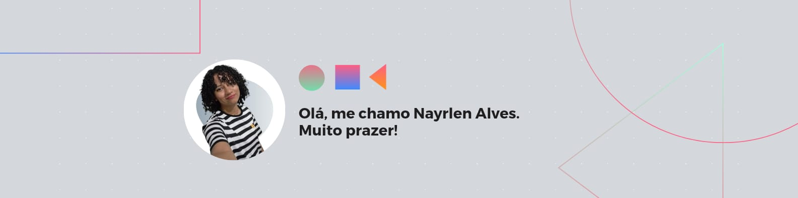

 

[comment]: <> (i create my banner in Canva editor for free.)

> "A própria luta para chegar ao cume basta para encher o coração de um homen" - Albert Camus

## Oá, mundo ! Eu sou [Nayrlen Alves](https://github.com/Nayrlen) 👋

### Desenvolvedora Web | Entusiasta de Tecnologia | Marvete nas horas vagas 

- 🧐 Estou "Open to work".
- 🌱 Estou me especializando em 'Desenvolvimento Web Fullstack'.
- 💬 Me pergunte sobre: 'HTML | CSS | JavaScript | Angular | Java | Spring Framework'
- 📫 Como entrar em contato comigo: [@nayrlenalves](https://www.linkedin.com/in/nayrlen-alves-77923a228) | [@nayalves.dev](https://instagram.com/nayalves.dev?utm_source=qr&igshid=MzNlNGNkZWQ4Mg%3D%3D) 

## 👨‍💻 Principais Techs e Ferramentas

[comment]: <> (Here you will change the badges with you favorite languages, tools and skills. Change the reference in the final url: '/html/html.png' for example.)

 
 

## 👨‍🎨 Explore some of my repositories, have fun

[comment]: <> (Here i use the vercel api, change the references in the url bellow)

<a href="https://github.com/brunomarcosluz/flutter-master-dev">
  
 
